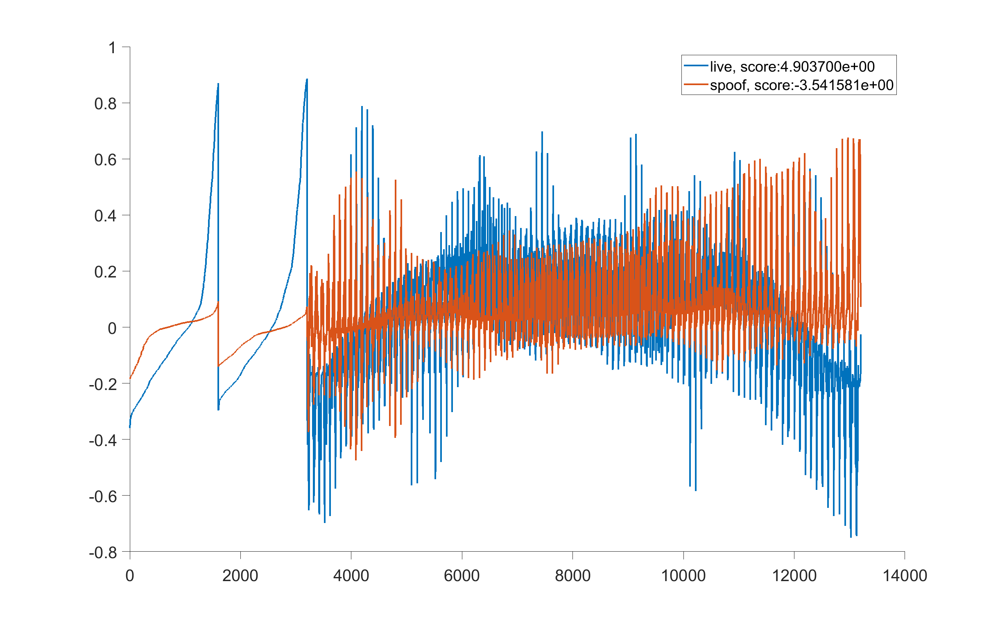

# SpecDiff-spoofing-detector
This repository contains an example code that calculates the SpecDiff descriptor proposed in our IJCB paper, [Specular- and Diffuse-reflection-based Face Spoofing Detection for Mobile Devices](https://arxiv.org/abs/1907.12400), to perform face presentation attack (spoofing) detection. The SpecDiff descriptor utilizes specular and diffuse reflection of a facial image, enables fast-and-accurate spoofing detection without either a large training database or a high-performance computing system.  
*Oct. 2020 update: our paper won **IJCB 2020 Google PC Chairs Choice Best Paper Award.**

## Tested computing environment
- MATLAB R2017b

## Tutorial of the example code
Run the main script, 'SpecDiff_main.m'. The script loads a pair of example photos, taken with and without flash, to compute the SpecDiff descriptor. The descriptor is classified to one of the two classes, live or spoof, by the Support Vector Machine (SVM) with a Radial Basis Function (RBF) kernel. Positive and negative value of classification scores indicate live and spoof class, respectively.

___Result Plot___



## Files and directories
- SpecDiff_main.m
  - The main script applies preprocessing to example photo pairs, and classify them into either live or spoof class.

- load_facial_images.m 
  - Load a pair of facial photo, one with flash and another without flash.
  
- preprocessing.m
  - Apply the seven preprocessing functions (i.e., Rotation, Grayscale, FaceDetection, FeatExtraction, FaceCrop, GaussFilter, and Resize) that is described in the paper.

- FaceDetection.m / FeatExtraction.m
  - Actual functions that are used to produce the experimental results presented in the paper are a commercial and cannot be fully disclosed. Instead, we load precalculated facial location and feature point locations in FaceDetection.m and FeatExtraction.m.
  
- FaceCrop.m
  - Crop face and iris regions from the input image.
  
- GaussFilter.m 
  - Apply Gaussian filter to the input image.

- calc_SpecDiff.m
  - Calculate the SpecDiff descriptor using the preprocessed iris and facial images.

- run_RBF_SVM.m
  - Classify the SpecDiff descriptor into either live or spoof class.

- face_cen/
  - A folder that contains positions of the center of faces.

- face_loc/
  - A folder that contains positions of the facial feature points.

- live_background/
  - A folder that contains example live facial photos taken without flash.

- live_flash/
  - A folder that contains example live facial photos taken with flash.
 
- spoof_background/
  - A folder that contains example spoof facial photos taken without flash.

- spoof_flash/
  - A folder that contains example spoof facial photos taken with flash.

- parameters/
  - A folder that contains the SVM pretrained parameters.
  


## Citation
___Please cite our paper if you use the whole or a part of our codes.___
```

@INPROCEEDINGS{SpecDiff,
  author    = {Akinori F. Ebihara and
               Kazuyuki Sakurai and
               Hitoshi Imaoka},
  booktitle={2020 IEEE International Joint Conference on Biometrics (IJCB)}, 
   title     = {Specular- and Diffuse-reflection-based Face Liveness Detection for
               Mobile Devices},
  year={2020}
  }

```
